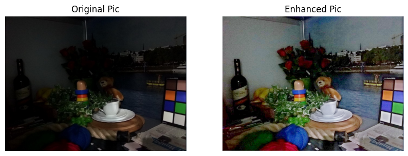
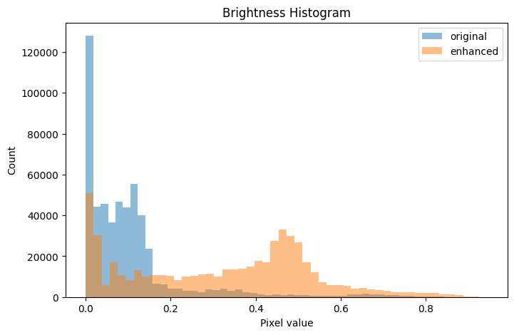
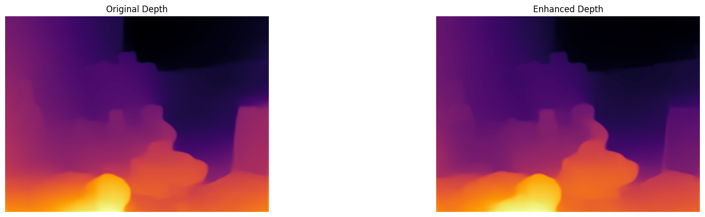
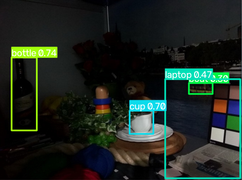
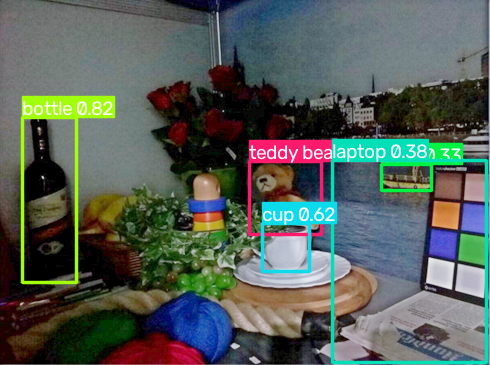

## 실험 목적

Zero-DCE로 저조도 이미지를 향상시켰을 때, 단순히 "화질이 좋아 보인다"를 넘어서 **실제 인식 태스크(depth estimation, object detection) 성능에도 도움이 되는지**를 직접 확인해보는 소규모 실험.

## 1. 환경 준비

```python
!git clone https://github.com/Li-Chongyi/Zero-DCE.git
%cd Zero-DCE/Zero-DCE_code
!python lowlight_test.py
```

Zero-DCE 공식 저장소를 클론하고, 사전학습된 가중치로 `data/test_data/`의 이미지들을 향상시켜 `data/result/`에 저장.

## 2. 원본/향상본 불러오기 + 정량 지표(밝기, 대비) 계산

```python
from PIL import Image
import numpy as np

original_path = "/content/Zero-DCE/Zero-DCE_code/data/test_data/LIME/8.bmp"
enhanced_path = "/content/Zero-DCE/Zero-DCE_code/data/result/LIME/8.bmp"

original = Image.open(original_path)
enhanced = Image.open(enhanced_path)

original_array = np.asarray(original) / 255
enhanced_array = np.asarray(enhanced) / 255

original_brightness = np.mean(original_array)
enhanced_brightness = np.mean(enhanced_array)
original_std = np.std(original_array)
enhanced_std = np.std(enhanced_array)

print(f"원본 밝기: {original_brightness}")
print(f"향상본 밝기: {enhanced_brightness}")
print(f"원본 대비(표준편차): {original_std}")
```

## 3. 시각화 — 원본/향상본 비교 + 밝기 히스토그램

```python
import matplotlib.pyplot as plt

plt.figure(figsize=(10, 5))
plt.subplot(1, 2, 1)
plt.axis('off')
plt.imshow(original)
plt.title("Original Pic")

plt.subplot(1, 2, 2)
plt.axis('off')
plt.imshow(enhanced)
plt.title("Enhanced Pic")

plt.figure(figsize=(8, 5))
plt.hist(original_array.flatten(), bins=50, alpha=0.5, label="original")
plt.hist(enhanced_array.flatten(), bins=50, alpha=0.5, label="enhanced")
plt.legend()
plt.xlabel("Pixel value")
plt.ylabel("Count")
plt.title("Brightness Histogram")
plt.show()
```





**결과**: 원본은 어두운 픽셀(0.0 근처)에 집중, 향상본은 0.4~0.5 구간으로 재분포됨 → **전반적 밝기 개선 확인**

## 4. MiDaS — Depth Estimation 비교

```python
import torch

model = torch.hub.load("intel-isl/MiDaS", "MiDaS_small")
midas_transforms = torch.hub.load("intel-isl/MiDaS", "transforms")
transform = midas_transforms.small_transform

# 원본
original_raw = np.asarray(original)
input_batch1 = transform(original_raw)
with torch.no_grad():
    prediction1 = model(input_batch1)
prediction1 = torch.nn.functional.interpolate(
    prediction1.unsqueeze(1),
    size=original_raw.shape[:2],
    mode="bicubic",
    align_corners=False,
).squeeze()
depth_original = prediction1.numpy()

# 향상본
enhanced_raw = np.asarray(enhanced)
input_batch2 = transform(enhanced_raw)
with torch.no_grad():
    prediction2 = model(input_batch2)
prediction2 = torch.nn.functional.interpolate(
    prediction2.unsqueeze(1),
    size=enhanced_raw.shape[:2],
    mode="bicubic",
    align_corners=False,
).squeeze()
depth_enhanced = prediction2.numpy()

plt.figure(figsize=(20, 5))
plt.subplot(1, 2, 1)
plt.imshow(depth_original, cmap='inferno')
plt.title("Original Depth")
plt.axis('off')

plt.subplot(1, 2, 2)
plt.imshow(depth_enhanced, cmap='inferno')
plt.title("Enhanced Depth")
plt.axis('off')
plt.show()
```



**결과**: depth map 상으로는 원본과 향상본이 거의 동일하게 나옴

→ **Zero-DCE의 밝기 개선이 MiDaS의 깊이 인식에는 유의미한 영향을 주지 못함**

## 5. YOLO — Object Detection 비교

```python
from ultralytics import YOLO

model_yolo = torch.hub.load('ultralytics/yolov5', 'yolov5s')

results1 = model_yolo(original)
results1.show()

results2 = model_yolo(enhanced)
results2.show()
```




**결과 (야간 골목 사진 기준)**: 원본에서 "car 0.36"으로 낮은 신뢰도 1건 탐지

**결과 (정물 사진 기준, 원본→향상본)**:
- bottle: 0.74 → 0.82 (신뢰도 상승)
- cup: 0.70 → 0.62 (신뢰도 **하락**)
- laptop: 0.47 → 0.38 (신뢰도 하락)
- **teddy bear: 원본에서 미탐지 → 향상본에서 신규 탐지**

→ object detection에서는 전반적으로 개선(신규 탐지, 일부 신뢰도 상승)되었으나, **일부 물체(흰색 계열)는 오히려 신뢰도가 하락** 하는 현상 관찰

## 6. 하락 원인 분석 — 컵 영역 크롭 비교

가설: 컵(흰색 물체)은 원래 밝았던 대상이라, 전체 밝기를 올리는 과정에서 오히려 주변과의 대비가 줄어들었을 수 있음

```python
original_cup = original_array[200:290, 270:350]
enhanced_cup = enhanced_array[200:290, 270:350]

print("원본 컵 영역 - 밝기:", np.mean(original_cup), "대비:", np.std(original_cup))
print("향상본 컵 영역 - 밝기:", np.mean(enhanced_cup), "대비:", np.std(enhanced_cup))
```

**결과**:
```
원본 컵 영역 - 밝기: 0.350   대비(표준편차): 0.275
향상본 컵 영역 - 밝기: 0.554   대비(표준편차): 0.229
```

**밝기는 상승(0.35→0.55)했지만, 대비는 오히려 감소(0.275→0.229)** → 가설 뒷받침됨. 흰 컵과 주변(접시, 배경)의 명암 차이가 향상 과정에서 줄어들면서, YOLO의 탐지 신뢰도 하락으로 이어진 것으로 추정.

## 종합 결론

```
히스토그램: 전체 밝기 개선 확인
    ↓
MiDaS: 그런데 depth estimation 성능엔 영향 없음
    ↓
YOLO: 반면 object detection에서는 개선(신규 탐지) + 부분적 하락(흰색 물체) 혼재
    ↓
컵 영역 크롭 분석: 그 하락의 원인이 "대비 감소"임을 수치로 확인
```

**화질 개선(사람이 보기에 밝아짐)이 모든 다운스트림 태스크·모든 물체에 균일하게 도움 되는 것은 아니다.** 태스크(depth vs detection)에 따라, 그리고 물체의 원래 밝기(어두웠는지 이미 밝았는지)에 따라 효과가 다르게 나타남 — 이는 서베이에서 배운 "Target Inconsistency" 문제를 소규모 실험으로 직접 확인한 사례.

## 참고 — 관련 최신 연구 (검색으로 확인)

- **IAIE_LDE** (ICASSP 2025): 조명 적응 보정 + 저조도 향상 + depth estimation을 하나의 파이프라인으로 묶어 학습
- **DepthDark** (2025): Depth Anything V2를 저조도에 맞게 파인튜닝, nuScenes-Night 등에서 SOTA
- **DeLightMono**: "기존 저조도 향상 기법들은 depth 네트워크를 효과적으로 guide하지 못한다"는 문제의식에서 출발 — 오늘 실험(MiDaS 결과 무변화)과 정확히 같은 관찰

→ 단순히 향상 모델과 인식 모델을 순서대로 이어붙이는 방식(오늘 한 실험)은 이미 여러 논문에서 "효과가 제한적"이라고 확인된 접근이며, 최신 연구들은 두 태스크를 처음부터 함께 학습(joint training)하는 방향으로 가고 있음.
